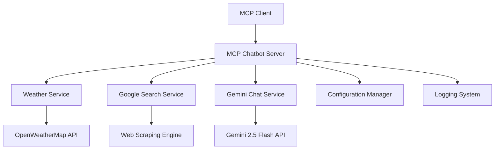

# Design Document

## Overview

The MCP Chatbot Server is a comprehensive Model Context Protocol server that provides conversational AI capabilities with integrated weather information and real-time Google search functionality. The system builds upon the existing weather MCP server implementation and extends it with Gemini 2.5 Flash API integration for natural language processing and web search capabilities without requiring Google API keys.

The server follows the MCP specification to provide tools that can be consumed by MCP clients, while also supporting direct integration patterns like the existing WhatsApp adapter.

## Architecture

### High-Level Architecture



### Core Components

1. **MCP Server Core** - FastMCP-based server handling MCP protocol communication
2. **Tool Registry** - Manages and routes requests to different tool implementations
3. **Weather Service** - Existing weather functionality (already implemented)
4. **Search Service** - Google search without API keys using web scraping
5. **Chat Service** - Gemini 2.5 Flash integration for conversational AI
6. **Configuration Manager** - Environment-based configuration with validation
7. **HTTP Client Manager** - Shared async HTTP client with retry logic

## Components and Interfaces

### MCP Tools Interface

```python
@mcp.tool()
async def chat(message: str, context: Optional[str] = None) -> Dict[str, Any]:
    """
    Process a chat message using Gemini 2.5 Flash API
    
    Args:
        message: User's chat message
        context: Optional conversation context
        
    Returns:
        Dict with 'ok', 'response', 'usage' fields
    """

@mcp.tool()
async def search_web(query: str, num_results: int = 5) -> Dict[str, Any]:
    """
    Perform Google search without API keys
    
    Args:
        query: Search query string
        num_results: Number of results to return (1-10)
        
    Returns:
        Dict with 'ok', 'results' (list of {title, snippet, url})
    """

@mcp.tool()
async def get_weather(city: str, units: str = "metric") -> Dict[str, Any]:
    """
    Existing weather tool (already implemented)
    """
```

### Service Layer Interfaces

```python
class ChatService:
    async def process_message(self, message: str, context: Optional[str] = None) -> ChatResponse
    async def _make_gemini_request(self, payload: Dict) -> httpx.Response

class SearchService:
    async def search_google(self, query: str, num_results: int = 5) -> SearchResponse
    async def _scrape_search_results(self, query: str) -> List[SearchResult]
    async def _parse_search_page(self, html: str) -> List[SearchResult]

class WeatherService:
    # Already implemented in puch.py
    async def get_weather_data(self, city: str, units: str) -> WeatherResponse
```

## Data Models

### Chat Models

```python
@dataclass
class ChatRequest:
    message: str
    context: Optional[str] = None
    max_tokens: int = 1000
    temperature: float = 0.7

@dataclass
class ChatResponse:
    ok: bool
    response: Optional[str] = None
    usage: Optional[Dict[str, int]] = None
    error: Optional[str] = None
    detail: Optional[str] = None
```

### Search Models

```python
@dataclass
class SearchResult:
    title: str
    snippet: str
    url: str

@dataclass
class SearchResponse:
    ok: bool
    results: List[SearchResult] = field(default_factory=list)
    query: Optional[str] = None
    error: Optional[str] = None
    detail: Optional[str] = None
```

### Configuration Models

```python
@dataclass
class ServerConfig:
    # Existing
    openweather_api_key: str
    openweather_base_url: str = "https://api.openweathermap.org/data/2.5/weather"
    
    # New
    gemini_api_key: str
    gemini_model: str = "gemini-2.5-flash"
    gemini_base_url: str = "https://generativelanguage.googleapis.com/v1beta"
    
    # Search settings
    search_user_agent: str = "Mozilla/5.0 (compatible; MCP-ChatBot/1.0)"
    search_timeout: int = 10
    search_max_results: int = 10
    
    # Server settings
    log_level: str = "INFO"
    log_file: str = "puch_weather.log"
```

## Implementation Strategy

### Phase 1: Core Chat Integration
- Extend existing FastMCP server with Gemini API integration
- Implement ChatService with proper error handling and retry logic
- Add chat tool to MCP tool registry
- Maintain existing weather functionality

### Phase 2: Google Search Implementation
- Implement web scraping-based Google search
- Create SearchService with result parsing
- Add search_web tool to MCP tool registry
- Implement rate limiting and respectful scraping practices

### Phase 3: Enhanced Integration
- Improve conversation context handling
- Add tool combination capabilities (e.g., "search for weather in Paris")
- Optimize performance and add caching where appropriate
- Enhanced error handling and logging

### Web Scraping Strategy for Google Search

Since we need to avoid API keys, we'll implement respectful web scraping:

1. **User Agent Rotation** - Use realistic browser user agents
2. **Request Throttling** - Add delays between requests to avoid rate limiting
3. **HTML Parsing** - Use BeautifulSoup or similar to extract search results
4. **Fallback Handling** - Graceful degradation when scraping fails
5. **Caching** - Short-term caching to reduce duplicate requests

```python
# Example search URL pattern
GOOGLE_SEARCH_URL = "https://www.google.com/search"

async def _scrape_google_search(self, query: str, num_results: int) -> List[SearchResult]:
    params = {
        'q': query,
        'num': min(num_results, 10),
        'hl': 'en'
    }
    
    headers = {
        'User-Agent': self.config.search_user_agent,
        'Accept': 'text/html,application/xhtml+xml,application/xml;q=0.9,*/*;q=0.8',
        'Accept-Language': 'en-US,en;q=0.5',
        'Accept-Encoding': 'gzip, deflate',
        'Connection': 'keep-alive',
    }
    
    # Implementation with proper error handling and parsing
```

## Error Handling

### Error Categories

1. **Configuration Errors** - Missing API keys, invalid settings
2. **Network Errors** - Timeouts, connection failures, rate limiting
3. **API Errors** - Invalid responses from Gemini or OpenWeather
4. **Scraping Errors** - Google blocking, parsing failures
5. **Validation Errors** - Invalid input parameters

### Error Response Format

All tools return consistent error responses:

```python
{
    "ok": False,
    "error": "error_category",  # e.g., "network", "auth", "validation"
    "detail": "Human-readable error message"
}
```

### Retry Strategy

- **Exponential Backoff** - For transient network errors
- **Rate Limit Handling** - Respect 429 responses with appropriate delays
- **Circuit Breaker Pattern** - For persistent service failures
- **Graceful Degradation** - Fallback responses when services are unavailable

## Testing Strategy

### Unit Tests
- Individual service classes (ChatService, SearchService)
- Input validation functions
- Error handling scenarios
- Configuration loading and validation

### Integration Tests
- MCP tool endpoints
- End-to-end API interactions
- Error propagation through the stack
- Retry logic and timeout handling

### Manual Testing
- MCP client integration testing
- Performance testing with concurrent requests
- Rate limiting behavior verification
- Search result quality assessment

### Test Data Management
- Mock API responses for consistent testing
- Test configuration with dummy API keys
- Isolated test environment setup

## Security Considerations

### API Key Management
- Environment variable configuration only
- Masked logging of sensitive data
- No API keys in code or version control
- Secure key rotation support

### Web Scraping Ethics
- Respectful request rates
- Proper User-Agent identification
- Compliance with robots.txt where applicable
- Graceful handling of anti-bot measures

### Input Validation
- Sanitize all user inputs
- Prevent injection attacks
- Rate limiting on tool usage
- Input length and format validation

## Performance Optimization

### HTTP Client Management
- Shared async HTTP client with connection pooling
- Configurable timeout and retry settings
- Connection limits to prevent resource exhaustion

### Caching Strategy
- Short-term response caching for identical requests
- Cache invalidation policies
- Memory-efficient cache implementation

### Resource Management
- Async/await throughout for non-blocking operations
- Proper cleanup of HTTP connections
- Memory usage monitoring and optimization

## Deployment and Configuration

### Environment Variables

```bash
# Required
OPENWEATHER_API_KEY=your_openweather_key
GEMINI_API_KEY=your_gemini_key

# Optional with defaults
GEMINI_MODEL=gemini-2.5-flash
PUCH_LOG_LEVEL=INFO
PUCH_LOG_FILE=puch_weather.log
SEARCH_USER_AGENT="Mozilla/5.0 (compatible; MCP-ChatBot/1.0)"
```

### Docker Support
- Containerized deployment option
- Multi-stage build for optimization
- Health check endpoints
- Graceful shutdown handling

### Monitoring and Observability
- Structured JSON logging
- Request/response metrics
- Error rate monitoring
- Performance timing logs